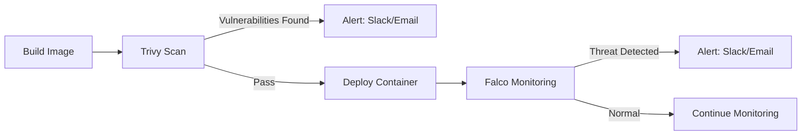

# DevSecOps Container Security Project
## Trivy + Falco with Slack/Email Alerts

A complete DevSecOps security pipeline demonstrating vulnerability scanning, runtime monitoring, and automated alerting for containerized applications.

---

## 📋 Project Overview

This project implements a comprehensive container security solution using:

- **Trivy** - Vulnerability scanning for Docker images (pre-deployment)
- **Falco** - Runtime security monitoring (post-deployment)  
- **Slack/Email Alerts** - Automated notifications for security events
- **Vulnerable Flask App** - Demo application with intentional security issues

## 🎯 Features

### ✅ Vulnerability Scanning (Trivy)
- Scans Docker images for known CVEs
- Detects vulnerabilities in OS packages and application dependencies
- Generates reports in multiple formats (JSON, HTML, TXT)
- Configurable severity thresholds (CRITICAL, HIGH, MEDIUM, LOW)

### ✅ Runtime Monitoring (Falco)
- Monitors container behavior using eBPF
- Detects suspicious activities in real-time
- Custom rules for application-specific threats
- System call level monitoring

### ✅ Automated Alerting
- Slack notifications for immediate response
- Email alerts with detailed vulnerability reports
- Customizable alert templates
- Severity-based routing

---

## 🏗️ Project Structure

```
devsecops-project/
├── app.py                    # Vulnerable Flask application
├── requirements.txt          # Python dependencies (outdated versions)
├── Dockerfile               # Container definition
├── .dockerignore            # Build exclusions
│
├── falco/
│   ├── install-falco.sh         # Falco installation
│   ├── setup-falco.sh           # Configuration setup
│   ├── run-falco.sh             # Manual execution script
│   ├── falco-custom-rules.yaml  # Custom security rules
│   ├── test-falco-alerts.sh     # Testing script
│   └── README.md                # Falco documentation
│
├── alerts/
│   ├── slack-alert.sh           # Slack webhook integration
│   ├── email-alert.py           # Email notification system
│   ├── scan-and-alert.sh        # Integrated scanner
│   └── alert-config.env         # Alert credentials (gitignored)
│
├── docker-compose.yml           # Container orchestration
└── README.md                    # This file
```

---

## 🚀 Quick Start

### Prerequisites

- Ubuntu 20.04+ (tested on 24.04)
- Docker & Docker Compose installed
- sudo access
- Internet connection

### 1. Clone Repository

```bash
cd ~/Documents/Project
git clone <your-repo-url> container-security
cd container-security
```

### 2. Build and Run Application

```bash
docker build -t vulnerable-app:latest .

# Or use docker-compose
docker-compose up -d
```

### 3. Install Trivy

```bash
#Install necessary packages
sudo apt-get install -y wget gnupg lsb-release

#Add the Aqua Security public key
wget -qO - https://aquasecurity.github.io/trivy-repo/deb/public.key | gpg --dearmor | sudo tee /usr/share/keyrings/trivy.gpg > /dev/null

#Add the Trivy repository to your sources list
echo "deb [signed-by=/usr/share/keyrings/trivy.gpg] https://aquasecurity.github.io/trivy-repo/deb $(lsb_release -sc) main" | sudo tee -a /etc/apt/sources.list.d/trivy.list

#Update your APT package list
sudo apt-get update

#Install trivy
sudo apt-get install -y trivy

#Verify the Installation
trivy --version
```

### 4. Run Vulnerability Scan

```bash
#Scans a Docker image
trivy image --severity HIGH,CRITICAL --format table -o trivy-image-report.txt vulnerable-app:latest

#Scans the file system (local project directory)
trivy fs --severity HIGH,CRITICAL --format table --output trivy-fs-report.txt .
```

### 5. Install Falco

```bash
cd ../falco
chmod +x install-falco.sh setup-falco.sh run-falco.sh
./install-falco.sh
./setup-falco.sh
```

### 6. Start Runtime Monitoring

```bash
# Option 1: systemd service (recommended)
sudo systemctl start falco-modern-bpf
sudo systemctl enable falco-modern-bpf

# Option 2: Manual execution
sudo ./run-falco.sh
```

### 7. Test Security Detection

```bash
#Open bash
docker exec -it devsecops-demo-app bash

# Run Falco tests (in different terminal)
./test-falco-alerts.sh

# Check alerts (in different terminal)
sudo journalctl -u falco-modern-bpf -f
```

### 8. Setup Alerts (Optional)

```bash
cd ../alerts

# Configure Slack webhook URL in slack-alert.sh
nano slack-alert.sh

# Configure email credentials in email-alert.py
nano email-alert.py

# Test alerts
./slack-alert.sh test
python3 email-alert.py test
```

---

## 📊 Demo Application

### Intentional Vulnerabilities

The Flask app includes:

| Vulnerability | Type | CVE Examples |
|--------------|------|--------------|
| SQL Injection | Application | Custom code |
| Command Injection | Application | Custom code |
| Path Traversal | Application | Custom code |
| Outdated Flask | Dependency | CVE-2023-30861 |
| Old requests library | Dependency | CVE-2023-32681 |
| Vulnerable cryptography | Dependency | Multiple CVEs |

### API Endpoints

```bash
# Health check
curl http://localhost:5000/health

# Trigger SQL injection (for testing)
curl http://localhost:5000/user/admin

# Execute command (triggers Falco!)
curl -X POST http://localhost:5000/execute \
  -H "Content-Type: application/json" \
  -d '{"command":"whoami"}'

# Read sensitive file
curl -X POST http://localhost:5000/file \
  -H "Content-Type: application/json" \
  -d '{"filename":"/etc/passwd"}'
```

---

## 🔍 Security Detection Examples

### Trivy Scan Results

```bash
Scan Results:
  CRITICAL: 3
  HIGH:     25
  MEDIUM:   74
  
⚠️  WARNING: CRITICAL vulnerabilities detected!

Top Critical/High Issues:
- Flask 2.0.1 → Update to 2.3.0+
- requests 2.25.1 → Update to 2.31.0+
- cryptography 3.4.7 → Update to 41.0.0+
```

### Falco Runtime Alerts

```bash
12:30:45.123: Warning Shell spawned in container
  (user=root command=/bin/sh container=devsecops-demo-app)

12:30:46.456: Warning Sensitive file opened for reading
  (file=/etc/passwd user=root container=devsecops-demo-app)

12:30:47.789: Notice Python spawned system process
  (parent=python command=whoami container=devsecops-demo-app)
```

---

## 📈 Workflow



---

## 🔧 Configuration (If facing some issues Copy these rules into respective file)


### Falco Rules

Custom rules in `/etc/falco/rules.d/falco-custom-rules.yaml`:

```yaml
- rule: Shell Spawned in Container
  desc: Detects a shell spawned inside the container
  condition: >
    evt.type = execve and
    container.id != host and
    container.name contains "devsecops-demo-app" and
    proc.name in (bash, sh, zsh)
  output: >
    Shell spawned in container (user=%user.name command=%proc.cmdline container=%container.name)
  priority: WARNING
  tags: [container, shell]

- rule: Suspicious Command Execution
  desc: Detect suspicious commands
  condition: >
    evt.type = execve and
    container.id != host and
    container.name contains "devsecops-demo-app" and
    proc.name in (whoami, id, ps, netstat, ifconfig, curl, wget)
  output: >
    Suspicious command (user=%user.name command=%proc.cmdline container=%container.name)
  priority: WARNING
  tags: [container, process]

- rule: Read Sensitive File
  desc: Detect reading of sensitive files
  condition: >
    evt.type in (open, openat) and
    evt.is_open_read=true and
    container.id != host and
    container.name contains "devsecops-demo-app" and
    fd.name in (/etc/passwd, /etc/shadow, /etc/sudoers)
  output: >
    Sensitive file read (user=%user.name file=%fd.name container=%container.name command=%proc.cmdline)
  priority: WARNING
  tags: [filesystem]

- rule: Python Subprocess
  desc: Python spawning system commands
  condition: >
    evt.type = execve and
    container.id != host and
    container.name contains "devsecops-demo-app" and
    proc.pname contains "python"
  output: >
    Python process (parent=%proc.pname command=%proc.cmdline container=%container.name)
  priority: NOTICE
  tags: [process, python]

```
Create Custom rules in `/etc/falco/rules.d/devsecops.yaml`

### Alert Configuration

### Configure Slack Webhook

- Get Slack Webhook URL:

  - Go to https://api.slack.com/apps
  - Click "Create New App" → "From scratch"
  - Name it "DevSecOps Bot", select your workspace
  - Go to "Incoming Webhooks" → Enable it
  - Click "Add New Webhook to Workspace"
  - Select a channel (create #security-alerts if needed)
  - Copy the Webhook URL (looks like: https://hooks.slack.com/services/T00000000/B00000000/XXXXXXXXXXXX)

- Get Gmail App Password

  - Go to https://myaccount.google.com/security
  - Enable 2-Step Verification first
  - Search for "App passwords"
  - Generate a new app password for "Mail"
  - Copy the 16-character password


```bash
export SLACK_WEBHOOK_URL="https://hooks.slack.com/services/YOUR/WEBHOOK/URL"
export SENDER_EMAIL="your-email@gmail.com"
export SENDER_PASSWORD="your-app-password"
export RECIPIENT_EMAIL="alerts@example.com"
```

Paste these credentials in alerts/alert-config.env and in alerts-config.sh. And copy paste the webhook inside slack-alert.sh replacing "Your_Slack_Webhook_URL_Here"

---

## 📚 Documentation

### Component Documentation
- [Falco Documentation](falco/README.md)
- [Application Documentation](app/README.md)

### External Resources
- [Trivy Official Docs](https://aquasecurity.github.io/trivy/)
- [Falco Official Docs](https://falco.org/docs/)
- [Docker Security Best Practices](https://docs.docker.com/engine/security/)

---

## 🧪 Testing

### Complete Test Suite

```bash
# 1. Build application
docker-compose up -d

# 2. Run Trivy scan
trivy image --severity HIGH,CRITICAL --format table -o trivy-image-report.txt vulnerable-app:latest

trivy fs --severity HIGH,CRITICAL --format table --output trivy-fs-report.txt .

# 3. Start Falco
cd ../falco && sudo ./run-falco.sh &

# 4. Trigger Falco alerts
./test-falco-alerts.sh

# 5. Test alerting
cd ../alerts
./slack-alert.sh test
python3 email-alert.py test

# 6. Integrated scan with alerts
./scan-and-alert.sh vulnerable-app:latest
```

---

## 🐛 Troubleshooting

### Container Won't Start
```bash
# Check logs
docker logs devsecops-demo-app

# Rebuild image
cd app && docker build -t vulnerable-app:latest . --no-cache
```

### Trivy Not Finding Vulnerabilities
```bash
# Update vulnerability database
trivy image --download-db-only

# Rescan
trivy image vulnerable-app:latest
```

### Falco Not Detecting Events
```bash
# Check service status
sudo systemctl status falco-modern-bpf

# Verify driver
sudo falcoctl driver printenv

# Check logs
sudo journalctl -u falco-modern-bpf -n 100
```

### Alerts Not Sending
```bash
# Test Slack webhook
curl -X POST $SLACK_WEBHOOK_URL -H 'Content-Type: application/json' -d '{"text":"Test"}'

# Test email with verbose output
python3 email-alert.py test
```

---

## 🎓 Learning Objectives

This project demonstrates:

✅ Container vulnerability scanning
✅ Runtime security monitoring  
✅ Security automation and DevSecOps principles
✅ Integration of multiple security tools
✅ Alert management and incident response
✅ Docker security best practices

---

## 📝 License

This project is for educational purposes only. The vulnerable application should never be deployed in production.

---

## 👥 Contributing

This is an academic project. For improvements:
1. Fork the repository
2. Create a feature branch
3. Submit a pull request

---

## 🙏 Acknowledgments

- [Aqua Security](https://www.aquasec.com/) for Trivy
- [Falco Project](https://falco.org/) for Falco
- [CNCF](https://www.cncf.io/) for supporting cloud native security

---

## 📞 Support

For issues or questions:
- Check the troubleshooting section
- Review component-specific READMEs
- Consult official documentation

---

**Built with ❤️ for DevSecOps learning**

docker build -t vulnerable-app:latest .

docker run --rm -it -p 5000:5000 vulnerable-app:latest

docker run -d -p 5000:5000 --name devsecops-demo-app vulnerable-app:latest

docker start devsecops-demo-app

trivy image --severity HIGH,CRITICAL --format table -o trivy-image-report.txt vulnerable-app:latest

trivy fs --severity HIGH,CRITICAL --format table --output trivy-fs-report.txt .

./slack-alert.sh test

python3 email-alert.py test

./scan-and-alert.sh vulnerable-app:latest